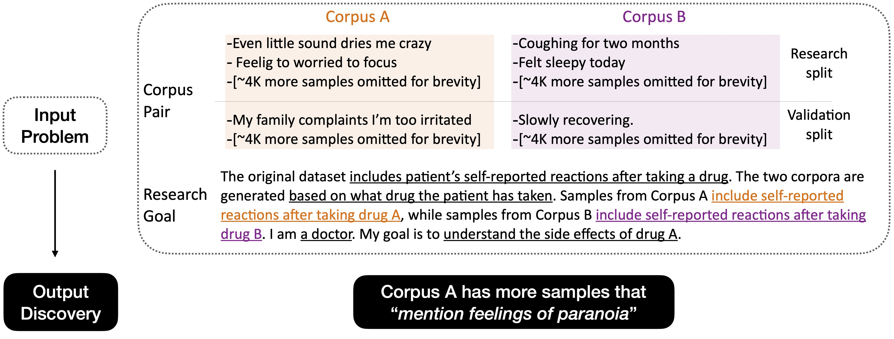

# Goal-Driven Discovery of Distributional Differences via Language Descriptions

[Paper link](https://arxiv.org/abs/2302.14233)

Authors: Ruiqi Zhong, Peter Zhang, Steve Li, JinWoo Ahn, Dan Klein, Jacob Steinhardt



An example D5 problem. The input is a pair of corpus and a research goal, and the output is a discovery in natural language. 

- [Setup](#setup)
- [Problem Representation](#problem-representation)
- [Dataset -- OpenD5](#dataset-opend5)
- [D5 System](#d5-system)
    - [Example](#running-on-an-example-problem)
    - [Implementation](#implementation)
- [Discoveries](#discoveries)
- [Contributing](#contributing)
- [Citation](#citation)

# Setup

We highly recommend you to run this in a conda environment.

Run
```
conda env create -f environment.yml
python3 -m nltk.downloader punkt stopwords averaged_perceptron_tagger
```

Alternatively, 

```
pip install torch --extra-index-url https://download.pytorch.org/whl/cu116
pip install -r requirements.txt
python3 -m nltk.downloader punkt stopwords averaged_perceptron_tagger
```

If you want to run ```lm_proposer.py```, you need to set the ```openai_key``` environment variable. To run our best system, you need also GPU devices that can run an 11B parameter model (the validator based on T5). However, you could also choose to use a smaller validator with only 3B/700M parameters (which gives slightly worse performance but has not been thoroughly tested).

# Problem Representation

```example_problem.pkl``` contains an example problem represented as a dictionary. Load with the following line:

```
problem = pkl.load(open('example_problem.pkl', 'rb'))
```

Each problem contains: 
- A corpus pair. Samples from the research of Corpus A are in ```problem['split']['research']['A_samples']```. Similar for Corpus B and the validation split.
- Research goal and how the data was collected: all the other fields. Refer to Figure 1 in the paper and the proposer prompt template in ```templates/gpt3_proposer.txt``` to interpret the values. In our format, you need to fill out four key fields ```generation```, ```user```, ```target``` and ```'dataset_description```. The field of ```example_hypotheses``` can be an empty list, but if you do have some example hypotheses in mind you can also fill them in. 

# Dataset (OpenD5)

Download the 675 problems in our paper from [this link](https://doi.org/10.5281/zenodo.7683302) , and the license information is in the appendix . The downloaded file is a ```.pkl``` file containing a list of problems. 
We also collected some other problems and due to license constraint you need to download them yourselves by running a script that we will provide you. 
The instruction to download the dataset can be seen [here](https://github.com/petezh/OpenD5).

# D5 System

## Running on an example problem
Run the command 

```
python3 run_example_problem.py --verifier_name ruiqi-zhong/d5_t5_validator_700M --subsample 1000 --find_representative --problem_path example_problem.pkl --output_path output.pkl
```

to see how to run our system on an example problem, which identifies the topical differences between news headlines from 2020 and 2019. 
We chose this as an example to illustrate our code since there is a simple discovery "talks more about Covid".

```output.pkl``` is an example output of our D5 system, which is a mapping from a hypothesis *h* to a list of information, which includes:
- ```sample2score```: a mapping from samples *x* to the *T'(h, x)* score
- ```provenance```: how the hypothesis was generated, e.g., what GPT-3 prompt and hyperparameter led to this hypothesis
- ```diff_w_significance```: *V*-value, along with its confidence interval and p-value of *V' = 0*

Here is a more detailed documentation of each argument.

```
usage: run_example_problem.py [-h] [--find_representative] [--subsample SUBSAMPLE]
                              [--verifier_name {dummy,ruiqi-zhong/d5_t5_validator,ruiqi-zhong/d5_t5_validator_700M,ruiqi-zhong/d5_t5_validator_3B}]
                              [--verifier_batch_size VERIFIER_BATCH_SIZE] [--problem_path PROBLEM_PATH] [--output_path OUTPUT_PATH]

optional arguments:
  -h, --help            show this help message and exit
  --find_representative
                        whether to find the representative samples from each corpus to prompt the proposer. If False, we will randomly select samples to prompt
                        the proposer.
  --subsample SUBSAMPLE
                        only consider <subsample> samples from each corpus to run faster.
  --verifier_name {dummy,ruiqi-zhong/d5_t5_validator,ruiqi-zhong/d5_t5_validator_700M,ruiqi-zhong/d5_t5_validator_3B}
                        The name of the verifier to use. If dummy, use a dummy verifier that returns random results. ruiqi-zhong/d5_t5_validator is the best
                        model we have trained, but it is large. ruiqi-zhong/d5_t5_validator_700M and ruiqi-zhong/d5_t5_validator_3B are smaller distilled
                        models that are faster to run but produce slightly worse results; however, they should still be able to perform easier tasks like
                        classifying topics.
  --verifier_batch_size VERIFIER_BATCH_SIZE
                        The batch size to use for the verifier. Decrease it if you are running out of memory.
  --problem_path PROBLEM_PATH
                        The path to the problem pickle file. You can also use your own problem pickle file.
  --output_path OUTPUT_PATH
                        The path to save the output pickle file. You can also use your own output pickle file.
```


```python3 global_run.py``` is a program that runs our system on the list of all problems in our benchmark. 

## Implementation

The overall logic is implemented in ```D5.py```, and the D5 class can take in (ordered) lists of samples from Corpus A and Corpus B, a proposer that can map two groups of sentences to a list of hypotheses, and a validator that can compute *T'(h, x)*.
The D5 class also offers other functionalities, such as stop computing the V values for hypotheses that are not promising.

```lm_proposer.py``` includes the implementation for prompting GPT-3 to propose hypotheses. If you want to implement a proposer yourself, you need to construct a proposer based on a problem and implement the ```propose_hypotheses``` function.

```validator.py``` includes the implementation for computing the V value for each hypothesis. Notice that ```global_run.py``` is currently using a **dummy validator** that returns random results. If you want to implement your own validator, you just need to implement the function ```validate_w_scores``` yourself. 

```validator_ft_data.json``` contains the turker ratings we used to fine-tune the human validator, which each input is a hypothesis and a text sample, and the output is a score between 0 and 1. Our best validator with 11B parameters achieved 0.765 spearman rank correlation coefficient with human rating. We fine-tuned Flan-T5 with 700M and 3B parameters by distilling the largest model on a much larger set of (hypothesis, text sample) pairs, and achieved 0.746 and 0.750 correlation, respectively. In comparison, Flan-T5 with 11B without additional fine-tuning achieved a score of 0.664 . 

```get_representative.py``` sort the samples by how "representative" they are for the corpus they came from. We implemented this by training RoBERTa classifiers to predict which corpus each sample come, and use it to score the representativeness of each sample by "how likely it comes from each corpus". 

# Discoveries

We ran our system on all the problems, including the ones which we cannot directly release and you need to download yourselves. 
The discoveries are stored in ```discoveries.json``` and you can inspect them with ```python3 review_discoveries.py```.

# Contributing

We are looking forward to more open problems on describing corpus level differences! 
Feel free to send emails to ruiqi-zhong@berkeley.edu that include problems in the format as the ```example_problem.pkl``` file above, and if the problem is interesting to us, we might run our system for you. 
This would help us improve our system in the future, and potentially help you discover new insights for your problem.

We would also love to chat if you are interested in other forms of collaboration. 

By default, we will not share any problem with other people unless we ask for your approval. 

# Evalution in Section 4.3

Our meaningfulness evaluation for the hypotheses are in ```sec4.3/meaningfulness_eval.csv```.
Run 

```python3 sec4.3/meaningfulness_eval_statistics.py``` 

to reporduce the evaluation we conducted in the paper.

```sec4.3/goals.json``` contains the full list of research goals for each problem of OpenD5 when this evaluation was run. 

# Discoveries in Section 5

```sec5/discoveries.json``` contains all the discoveries section 5 produces, along with their V' value and p-value. 

Run ```python3 sec5/read.py``` to read an example discovery.

# Citation

Corresponding: ruiqi-zhong@berkeley.edu

```
@misc{https://doi.org/10.48550/arxiv.2302.14233,
  doi = {10.48550/ARXIV.2302.14233},
  
  url = {https://arxiv.org/abs/2302.14233},
  
  author = {Zhong, Ruiqi and Zhang, Peter and Li, Steve and Ahn, Jinwoo and Klein, Dan and Steinhardt, Jacob},
  
  keywords = {Computation and Language (cs.CL), Artificial Intelligence (cs.AI), Machine Learning (cs.LG), FOS: Computer and information sciences, FOS: Computer and information sciences},
  
  title = {Goal Driven Discovery of Distributional Differences via Language Descriptions},
  
  publisher = {arXiv},
  
  year = {2023},
  
  copyright = {Creative Commons Attribution 4.0 International}
}
```
